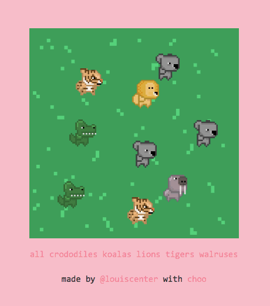
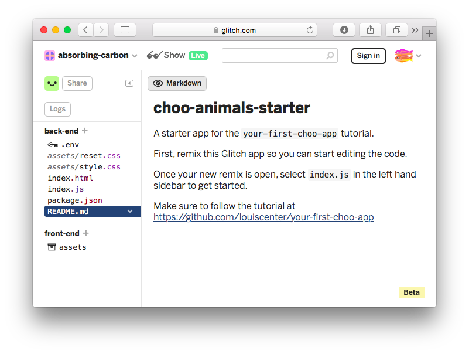
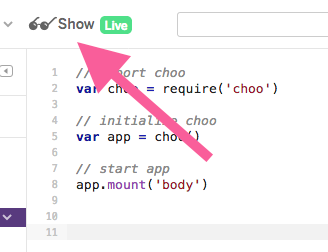
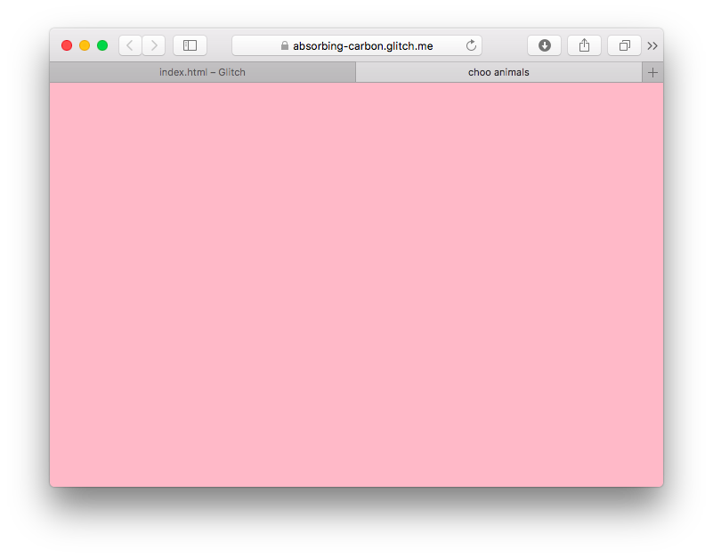
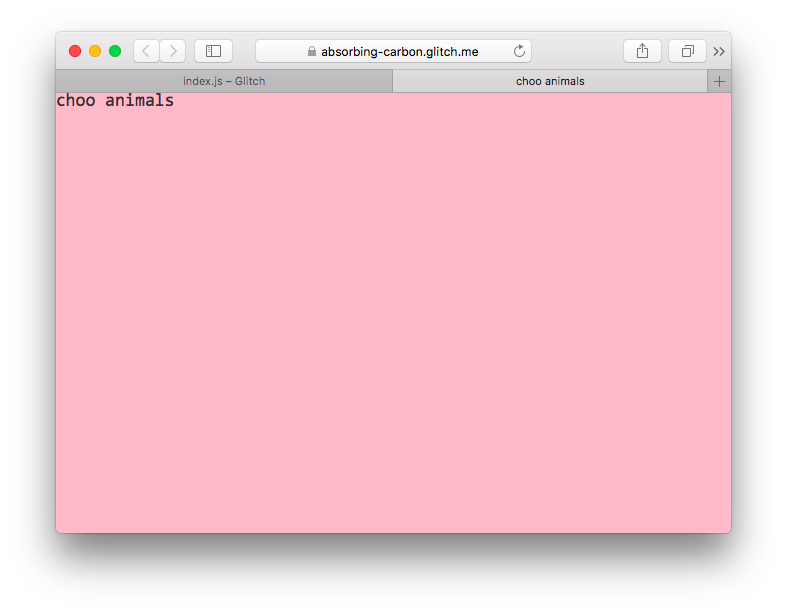

# NOTE
This guide is a WIP. You can review the final app's code here: [https://glitch.com/edit/#!/project/choo-animals](https://glitch.com/edit/#!/project/choo-animals)

# your first choo app
This page will guide you through your first steps as you build an interactive web app with `choo`.

## Who is this for?
If you're comfortable with the basics of JavaScript, but you've never built an interactive web app before, this guide is for you.

If you are a seasoned JavaScript developer with experience in other frameworks, and are looking to try `choo` for the first time, this guide is also for you.

## Requirements
This guide will assume you are comfortable with the basics of JavaScript, HTML, and CSS.

## What is choo?
`choo` is a small framework that helps you build web apps with JavaScript.

JavaScript makes it easier to add fun interactive elements to our HTML pages. As the language has gained in popularity, developers are now choosing to build their websites entirely with JavaScript. This offers many benefits to both users and developers, most notably that websites can now behave similarly to native desktop or mobile applications.

`choo` provides a small but powerful collection of tools that commonly feature in JavaScript web apps, such as templating, routing, and state management. By the end of this guide, you will understand what these terms mean. Don't be concerned if you don't already know what they are. This is why you are here! :)

## What will we build?
Today we're going to build an interactive animal simulator called `choo animals`. It will be informative, cute, but most of all, fun!

This is what it looks like:

[](https://choo-animals.glitch.me)

The user can click anywhere on the grass to add an animal to the field. Clicking on an animal will remove it from the field. The user can also filter which animals they see, using the filter links at the bottom of the page.

You can try it for yourself here: [https://choo-animals.glitch.me](https://choo-animals.glitch.me)

## Let's get started!
For this guide, we will be using an online code editor called [Glitch](https://glitch.com/).

Glitch lets us write, edit and deploy JavaScript code in the browser. This is useful because we can make changes to our code and see the updated results instantly.

A starter project is available for you to follow along with this guide: [https://glitch.com/edit/#!/project/choo-animals-starter](https://glitch.com/edit/#!/project/choo-animals-starter)

When the editor has finished loading, you should make your own copy of the project so you can begin editing it. To do this, click the `Remix this` button near the top left hand corner of the window:


Your screen should now looking something like the following:



## Starting choo
In our project's left sidebar, click on the `index.js` file to open its code in the code editor.

You will see the following:

```js
// import choo
var choo = require('choo')

// initialize choo
var app = choo()

// start app
app.mount('div')
```

At the top of this file, we are importing the `choo` framework into our project using the `require()` function.

`require()` allows us to import other JavaScript files into our code. `require()` does a lot more than this, but if you're not already familiar with its concepts, for this tutorial all you need to remember is that we will use it to import `choo`, and a handful of other files we write ourselves into our application.

We then need to create an instance of `choo` that we build our app with. We initialize this instance using `choo()`, and then store it in the `app` variable. From this point onwards, when we interact with choo, it will be via `app`.

Finally, we start our application by appending it on onto the `<div>` element of the HTML page our app will run on. We do this using the `app.mount()` method that `choo` conveniently makes available to us. If you open the `index.html` file, you'll see there is a single `<div>` element inside `<body>`. This is where `app.mount()` attaches our code onto.

At this point, we can take a look at what our app currently looks like.

To do this, press the `Show` button near the top left hand corner of the window:



A new browser window will open showcasing our application. However, as you'll see, the screen will be blank:



Our application does not yet contain any templates, or any routes. This means that if we try to run our application, we will only ever see a blank page.

Let's fix this.

## Building a template
In web app development, a template often refers to a piece of code that will help us render some HTML to the screen. Being templates, they will render most of the same information each time, but change slightly depending on the different bits of input they receive.

Templates are essentially functions: given some input, they will render a new output depending on what happens inside the function.

`choo` provides another module we can import that will help us build HTML templates with "template strings", one of JavaScript's newer syntax features.

Let's update the code in our `index.js` file to read the following:

```js
// import choo
var choo = require('choo')

// import choo's template helper
var html = require('choo/html')

// initialize choo
var app = choo()

// create a template
var main = function () {
  return html`<div>choo animals</div>`
}

// start app
app.mount('div')
```

Underneath our `choo` import near the top of the file, we're now also importing `choo`'s html helper. This becomes accessible via the `html` variable.

Towards the end of the file, we're creating a function, and assigning it to the `main` variable. Inside the function, we're returning a template that we'll use to render `<div>choo animals</div>` on our page.

This bit of code might be confusing, so let's disect further.

The `html` variable references a function that parses template strings containing HTML code (eg. `` html`<h1>choo</h1>` ``). A given template string will be interpreted into a special data structure, that `choo` then renders as HTML on the page.

## Creating a route
When a friend links you to a specific page on a website, that URL acts as a route so the server knows where to direct you.

Many JavaScript web apps use this same concept to figure out which template to show you at a given point within the application.

This means that to see something on our page, we need to create a route that directs us to the template we just made:

```js
// ...
// initialize choo
var app = choo()

// create a template
var main = function () {
  return html`<div>choo animals</div>`
}

// create a route
app.route('/', main)

// start app
app.mount('div')
```

The `app.route()` function takes in two arguments, the first being the URL path you want to create (this should be specified as a string), and the second being the template you'd like to show users when they arrive at that path (usually a variable that references the template).

As this is our first route, we will make it the "index" (or "root") of the entire application. We do this by specifying the route as `'/'`. This route would be the equivalant of visiting something like `https://choo.io` (the home page). Creating a route with the path `/cats` would be the equivalant of visiting `https://choo.io/cats`.

As we change the code in Glitch's editor, our app's window should automatically update itself. If you open it, you should see the following:



If your app hasn't updated yet, you can simply refresh the window yourself.

Now that we can see text on the screen, this means that you successfully got `choo` working! Congratulations :)

We're not finished yet, but let's quickly summarise what we've done so far:

- First we initialised `choo`, and mounted it onto the page.
- Then we created a template using `choo`'s HTML template function.
- Finally, we created an index route (`/`), and pointed it to our newly made template.

