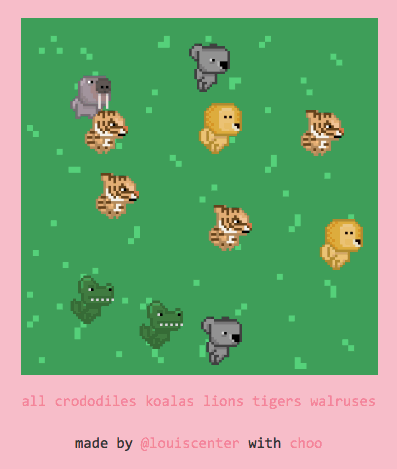
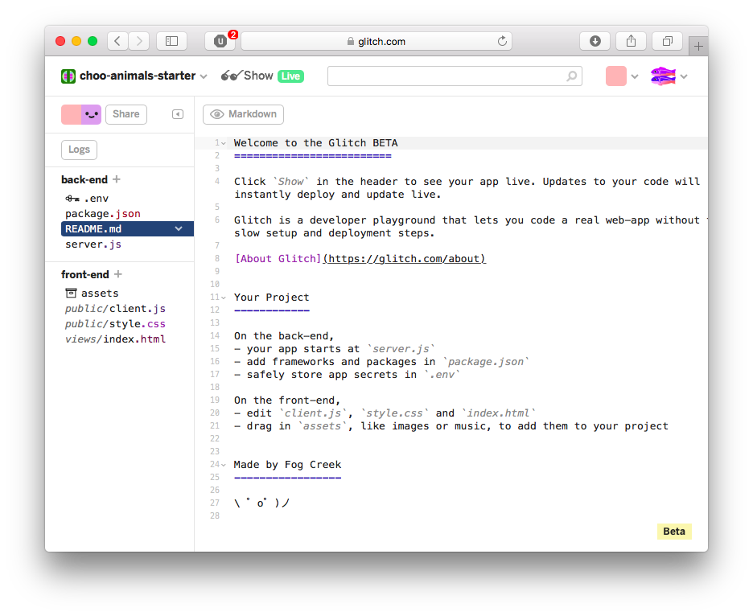

# your first choo app
This page will guide you through your first steps as you build an interactive web app with `choo`.

## Who is this for?
If you're comfortable with the basics of JavaScript, but you've never built an interactive web app before, this guide is for you.

If you are a seasoned JavaScript developer with experience in other frameworks, and are looking to try `choo` for the first time, this guide is also for you.

## Requirements
This guide will assume you are comfortable with the basics of JavaScript, HTML, and CSS.

## What is choo?
`choo` is a small framework that helps you build web apps with JavaScript.

JavaScript makes it easier to add fun interactive elements to our HTML pages. As the language has gained in popularity, developers are now choosing to build their websites entirely with JavaScript. This offers many benefits to both users and developers, most notably that websites can now behave similarly to native desktop or mobile applications.

`choo` provides a small but powerful collection of tools that commonly feature in JavaScript web apps, such as templating, routing, and state management. By the end of this guide, you will understand what these terms mean. Don't be concerned if you don't already know what they are. This is why you are here! :)

## What will we build?
Today we're going to build an interactive animal simulator called `choo animals`. It will be informative, cute, but most of all, fun!

This is what it looks like:

The user can click anywhere on the grass to add an animal to the field. Clicking on an animal will remove it from the field. The user can also filter which animals they see, using the filter links at the bottom of the page.

You can try it for yourself here: [https://choo-animals.glitch.com](https://choo-animals.glitch.com)

## Let's get started!
For this guide, we will be using an online code editor called [Glitch](https://glitch.com/).

Glitch lets us write, edit and deploy JavaScript code in the browser. This is useful because we can make changes to our code and see the updated results instantly.

A starter project is available for you to follow along with this guide: [https://glitch.com/edit/#!/project/choo-animals-starter](https://glitch.com/edit/#!/project/choo-animals-starter)

When the editor has finished loading, you should make your own copy of the project so you can begin editing it. To do this, click the `Remix this` button near the top left hand corner of the window:

Your screen should now looking something like the following:

** BELOW IS PLACEHOLDER IMAGE **

