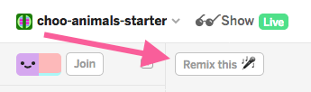
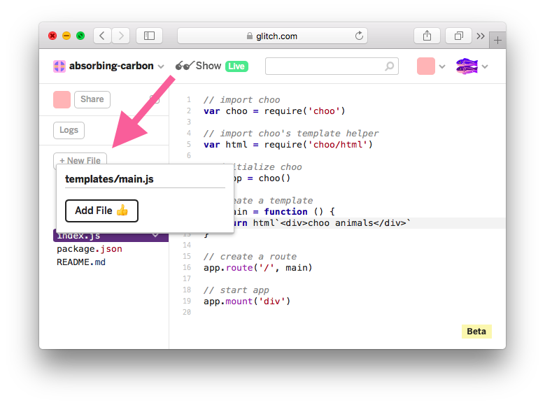
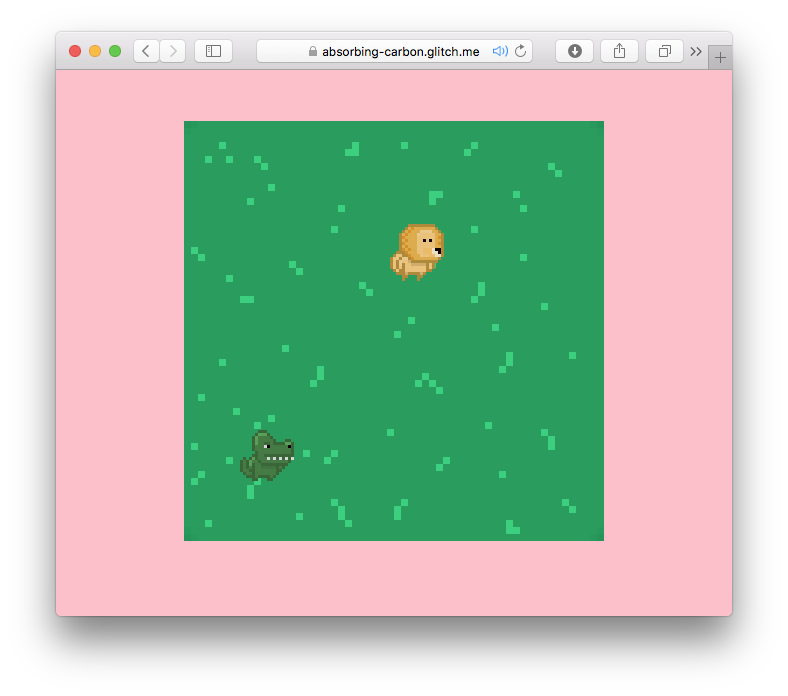
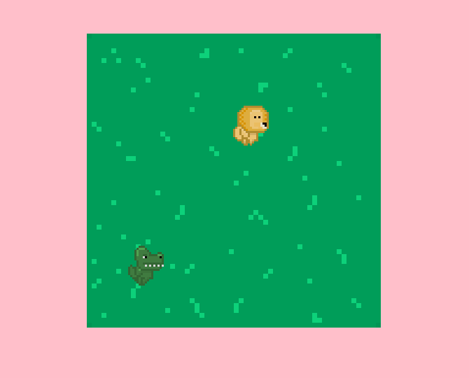

# NOTE
This guide is a WIP. You can review the final app's code here: [https://glitch.com/edit/#!/project/choo-animals](https://glitch.com/edit/#!/project/choo-animals)

# your first choo app
This page will guide you through your first steps as you build an interactive web app with `choo`.

## Who is this for?
If you're comfortable with the basics of JavaScript, but you've never built an interactive web app before, this guide is for you.

If you are a seasoned JavaScript developer with experience in other frameworks, and are looking to try `choo` for the first time, this guide is also for you.

## Requirements
This guide will assume you are comfortable with the basics of JavaScript, HTML, and CSS.

## What is choo?
`choo` is a small framework that helps you build web apps with JavaScript.

JavaScript makes it easier to add fun interactive elements to our HTML pages. As the language has gained in popularity, developers are now choosing to build their websites entirely with JavaScript. This offers many benefits to both users and developers, most notably that websites can now behave similarly to native desktop or mobile applications.

`choo` provides a small but powerful collection of tools that commonly feature in JavaScript web apps, such as templating, routing, and state management. By the end of this guide, you will understand what these terms mean. Don't be concerned if you don't already know what they are. This is why you are here! :)

## What will we build?
Today we're going to build an interactive animal simulator called `choo animals`. It will be informative, cute, but most of all, fun!

This is what it looks like:

[](https://choo-animals.glitch.me)

The user can click anywhere on the grass to add an animal to the field. Clicking on an animal will remove it from the field. The user can also filter which animals they see, using the filter links at the bottom of the page.

You can try it for yourself here: [https://choo-animals.glitch.me](https://choo-animals.glitch.me)

## Let's get started!
For this guide, we will be using an online code editor called [Glitch](https://glitch.com/).

Glitch lets us write, edit and deploy JavaScript code in the browser. This is useful because we can make changes to our code and see the updated results instantly.

A starter project is available for you to follow along with this guide: [https://glitch.com/edit/#!/project/choo-animals-starter](https://glitch.com/edit/#!/project/choo-animals-starter)

When the editor has finished loading, you should make your own copy of the project so you can begin editing it. To do this, click the `Remix this` button near the top left hand corner of the window:



Your screen should now looking something like the following:


## Starting choo
In our project's left sidebar, click on the `index.js` file to open its code in the code editor.

You will see the following:

```js
// import choo
var choo = require('choo')

// initialize choo
var app = choo()

// start app
app.mount('div')
```

At the top of this file, we are importing the `choo` framework into our project using the `require()` function.

`require()` lets us import other JavaScript files into our code. `require()` does a lot more than this, but if you're not already familiar with its concepts, for this tutorial all you need to remember is that we will use it to import `choo`, and a handful of other files we write ourselves into our application.

We then need to create an instance of `choo` that we build our app with. We initialize this instance using `choo()`, and then store it in the `app` variable. From this point onwards, when we interact with choo, it will be via `app`.

Finally, we start our application by appending it on onto the `<div>` element of the HTML page our app will run on. We do this using the `app.mount()` method that `choo` conveniently makes available to us. If you open the `index.html` file, you'll see there is a single `<div>` element inside `<body>`. This is where `app.mount()` attaches our code onto.

At this point, we can take a look at what our app currently looks like.

To do this, press the `Show` button near the top left hand corner of the window:


A new browser window will open showcasing our application. However, as you'll see, the screen will be blank:


Our application does not yet contain any templates, or any routes. This means that if we try to run our application, we will only ever see a blank page.

Let's fix this.

## Building a template
In web app development, a template often refers to a piece of code that will help us render some HTML to the screen. Being templates, they will render most of the same information each time, but change slightly depending on the different bits of input they receive.

Templates are essentially functions: given some input, they will render a new output depending on what happens inside that function.

`choo` provides another module we can import that will help us build HTML templates with "template strings", one of JavaScript's newer syntax features.

Let's update the code in our `index.js` file to read the following:

```js
// import choo
var choo = require('choo')

// import choo's template helper
var html = require('choo/html')

// initialize choo
var app = choo()

// create a template
var main = function () {
  return html`<div>choo animals</div>`
}

// start app
app.mount('div')
```

Underneath our `choo` import near the top of the file, we're now also importing `choo`'s html helper. This becomes accessible via the `html` variable.

Towards the end of the file, we're creating a function, and assigning it to the `main` variable. Inside the function, we're returning a template that we'll use to render `<div>choo animals</div>` on our page.

This bit of code might be confusing, so let's disect further.

The `html` variable references a function that parses template strings containing HTML code (eg. `` html`<h1>choo</h1>` ``). A given template string will be interpreted into a special data structure, that `choo` then renders as HTML on the page.

## Creating a route
When a friend links you to a specific page on a website, that URL acts as a route so the server knows where to direct you.

Many JavaScript web apps use this same concept to figure out which template to show you at a given point within the application.

This means that to see something on our page, we need to create a route that directs us to the template we just made:

```js
// ...
// initialize choo
var app = choo()

// create a template
var main = function () {
  return html`<div>choo animals</div>`
}

// create a route
app.route('/', main)

// start app
app.mount('div')
```

The `app.route()` function takes in two arguments, the first being the URL path you want to create (this should be specified as a string), and the second being the template you'd like to show users when they arrive at that path (usually a variable that references the template).

As this is our first route, we will make it the "index" (or "root") of the entire application. We do this by specifying the route as `'/'`. This route would be the equivalant of visiting something like `https://choo.io` (the home page). Creating a route with the path `/cats` would be the equivalant of visiting `https://choo.io/cats`.

As we change the code in Glitch's editor, our app's window should automatically update itself. If you open it, you should see the following:


If your app hasn't updated yet, you can simply refresh the window yourself.

Now that we can see text on the screen, this means that you successfully got `choo` working! Congratulations :)

We're not finished yet, but let's quickly summarise what we've done so far:

- First, we initialised `choo`, and mounted it onto the page.
- We then created a template using the `choo/html` template function.
- Finally, we created an index route (`/`), and pointed it to our newly made template.

## Modularising our templates
Just like we can `require()` third-party modules like `choo` into our application, we can break our code down into smaller pieces so that the different concerns of our app exist in their own neat little files.

If we were to modularise what we currently have, it would likely be considered "pre-optimisation", since there's not much code there anyway. Attempts to break it out further would likely just increase complexity, but as we're about to add a lot of new markup to our `main` template in just a moment, let's go ahead and break it out into its own file.

In Glitch's left sidebar, click the `+` icon next to `back-end`. Specify your new file's path as `components/main.js`, then click `Add File 👍`:



First this creates a new folder named `components`, and then adds a file called `main.js` inside of it. This file should now appear in the sidebar.

Let's add some code to our new `components/main.js` file:

```js
// import choo's template helper
var html = require('choo/html')

// export module
module.exports = function () {
  // create html template
  return html`
    <div class="container">
      <div class="grass">
        
      </div>
    </div>
  `
}
```

What's happening here?

First, we are importing `choo`'s html helper so that we can build a new template within this file.

Next, we are assigning a function that returns a template to the variable called `module.exports`. What does this variable do exactly? In the context of this application, when we create JavaScript files that we'd like to import into other JavaScript files, whatever is assigned to `module.exports` is what will be exported out.

Inside of our template code, we've added some markup that will display an image called `bg.gif` on the page.

__*(NOTE: There are some asset files this project requires that you won't be able to see in Glitch's left sidebar. This image is an example of one those files. Other assets will crop up later in this tutorial, but I'll be sure to point them out to you.)*__

Now let's `require()` this new template into our `index.js` file, and see the results.

Start by adding this line towards the top of `index.js`:

```js
// ...
// import choo's template helper
var html = require('choo/html')

// import template
var main = require('./components/main.js')

// initialize choo
var app = choo()
// ...
```

Underneath the line where we import `choo`'s html helper, we are now importing the `main.js` file we just created. Remembering that we exported a function that returns a template, we can now use that as the designated component for our `/` route.

If we delete the `main` template that's currently located in `index.js`, that file should now look like this:

```js
// import choo
var choo = require('choo')

// import choo's template helper
var html = require('choo/html')

// import template
var main = require('./components/main.js')

// initialize choo
var app = choo()

// create a route
app.route('/', main)

// start app
app.mount('div')
```

If we look at our application, we should now see the following:


Awesome! Let's recap what we just did:

- First, we created a file called `main.js` inside of a new folder called `components`.
- Inside `main.js`, we created a new template function and then exported it using `module.exports`.
- Finally, we imported `main.js` into `index.js`, and then plugged it into our `/` route.

Now that we have a nice grass field to play in, let's start adding some animals.

## Adding state to our application
A core behaviour of many modern web applications is that they can be entirely driven and interacted with, without having to refresh or navigate to another static HTML page.

When you browse a website like [Wikipedia](https://wikipedia.org) or [Mozilla Developer Network](https://developer.mozilla.org/en-US/docs/Web/JavaScript), each new page you navigate to, or each piece of functionality you interact with, will require a new page from the server to load in your browser.

In `choo`, the idea is that when information is changed or new information becomes available, the page will automatically update itself to reflect that, much in the same way that a native desktop or mobile application would.

To do this, `choo` uses the concept of "application state" to drive the output of its templates. This could mean absolutely nothing to you right now, so it's a good opportunity to dive further into what "state" is and how it works.

In programming, it's commonplace for a script to have several variables which contain information that you pass into a function. A function will typically do the same thing each time you run it, so when you pass the same variables in as arguments again and again, it will keep returning the same result:

```js
var obj = { fun: true, name: 'Alice' }

function sentence() {
  if (fun) {
    console.log(`Yay! ${name} is having fun!`)
  } else {
    console.log(`Oh no, ${name} is not having fun.`)
  }
}

sentence()
sentence()
sentence()

// the following is logged to screen:
// "Yay! Alice is having fun!"
```

As mentioned earlier in this guide:

*"Templates are essentially functions: given some input, they will render a new output depending on what happens inside that function."*

In `choo`, state is passed down into our templates so that we can change what our templates do depending on what is currently contained in that state.

Let's demonstrate this concept by adding new code to our `index.js` file:

```js
// ...

// initialize choo
var app = choo()

app.use(function (state) {
  // initialize state
  state.animals = {type: 'lion', x: 200, y: 100}
}

// declare routes
app.route('/', main)

// ...
```

Underneath our initialization of `choo`, we are calling `app.use()` and passing a function into it. The function we pass in receives a `state` object which represents the state of our entire application. Although it has a wider scope of usage, for now we can just call `app.use()` when we want to setup the initial parameters of our application's state.

Inside of `app.use()`, we're creating a new property on the `state` object called `state.animals`. We're then assigning it an object that contains some parameters we'll use to place a new animal on our screen: `type` sets which animal we want, and the `x` and `y` properties will dictate the animal's position coordinates.

## Passing state into our templates
Now that we've set a new property on our state object, we can access this state from any templates that our router calls.

Let's flip over to `components/main.js`, and update our template function:

```js
// import choo's template helper
var html = require('choo/html')

// export module
module.exports = function (state) {
  var type = state.animals.type
  var x = state.animals.x
  var y = state.animals.y

  // create html template
  return html`
    <div class="container">
      <div class="grass">
        
        
      </div>
    </div>
  `
}
```

A few things have changed, so let's briefly dive in to see what's happening:

First, the function that we're exporting now takes in an argument called `state`. This is same `state` object we were dealing with in `index.js`, after it has been run through `app.use()`. This means that the `state.animal` property is now available to us inside this template.

Inside the function, we're initializing a set of variables that point to the different part of our `state.animals` object. Then, inside of our template string, we've created a new `` element. This `` will represent an animal we place on screen. 

As mentioned earlier, we have several different images located inside an invisible `assets` folder in Glitch. They are:

- `assets/bg.gif`
- `assets/crocodile.gif`
- `assets/koala.gif`
- `assets/lion.gif`
- `assets/tiger.gif`
- `assets/walrus.gif`

We can use the `state.animals.type` property that has been passed into our template to point to the correct image we need to render the animal on screen (`src="/assets/${type}.gif"`).

Then, we can set a `style` property on the same `` element to position the animal using `top` and `left`. These correspond to our `state.animals.x` and `state.animals.y` values.

You've probably noticed the interesting `${}` syntax being used inside of our template strings. If you're not already familiar with them, these are called expressions. By placing short JavaScript expressions inside these curly braces, the code will be evaluated and replaced with its returned value. In this case, `${type}` will evaluate to `'lion'`, `${x}` will evaluate to `200`, and so on.

If we look at our application now, you should see something cute like this:


Nice! A super sweet lion has decided to come and hang out with us while we code :)

That was a lot to digest, so let's quickly go over what we just did:

- First, we setup `app.use()` in our `index.js` file.
- Inside of `app.use()`, we then initialized our app's `state` object by describing the type and coordinates of an animal.
- Then, we updated our `main.js` template to reflect the information stored in state.

As a result, an animal is now rendered on the screen.

It would be cool to have more animals roaming around without copying and pasting additional `` elements into our template. Instead, we should add more animals into our state, then have our template reflect those changes.

## Rendering templates with loops
The `state.animals` property currently refers to a single object, representing one animal. If we want to render multiple animals on the screen, we'd need a way of representing multiple animals inside this property.

Using an array, we can store multiple objects inside of it, each representing an animal that the user should see.

Let's head to `index.js` and update our initialized state to reflect this change:

```js
// ...

// initialize choo
var app = choo()

app.use(function (state) {
  // initialize state
  state.animals = [
    {type: 'lion', x: 200, y: 100},
    {type: 'crocodile', x: 50, y: 300}
  ]
}

// declare routes
app.route('/', main)

// ...
```

`state.animals` now refers to both a Lion and a Crocodile, but `components/main.js` also needs to be updated to handle this restructure.

Our template should render each animal regardless of how many there are in state. To do this, we can program our template to iterate across `state.animals`, rendering a block of HTML for each animal that exists in the array.

First, let's create a new file in Glitch with the filepath `components/animal.js`. This template will represent a single animal, and will be used to iterate over `state.animals` inside of `components/main.js`.

Let's wire up `components/animal.js` with the following code:

```js
var html = require('choo/html')

module.exports = function (animal) {
  var type = animal.type
  var x = animal.x
  var y = animal.y

  // create html template
  return html`
    
  `
}
```

This code you've seen before, as it already exists inside of `components/main.js`. We're breaking this template out into its own function so that we can refer to it each time we iterate over `state.animals`. Let's do that now by updating `components/main.js`:

```js
var html = require('choo/html')
var animal = require('./animal.js')

// export module
module.exports = function (state) {
  // create html template
  return html`
    <div class="container">
      <div class="grass">
        
        ${state.animals.map(animal)}
      </div>
    </div>
  `
}
```

In `components/main.js`, we've replaced the HTML markup we shifted into `components/animal.js` with `${state.animals.map(animal)}`. What is happening here?

In JavaScript, arrays come with a built-in method called `map()`. When we call `map()`, we also pass into it another function which is executed against every item in the array. Each time the function runs, the current item is passed in as an argument. When `map()` is finished running, it will return a new array with each function's return value.

For example:

```js
var array = [1, 2, 3]
var newArray = array.map(function (num) {
  return 1 * 2
})

console.log(newArray)
// [2, 4, 6]
```

In the context of our application, we are using `map()` to iterate across each animal in our `state.animals` array. By passing in our `components/animal.js` template into `map()`, we can then create a new array of templates that each represent an animal. These are then rendered in place of `${state.animals.map(animal)}`.

If you look again inside of `components/animal.js`, you'll see that an `animal` is passed in as an argument each time the exported function is run. We are then grabbing the `type` and `x/y` information of the animal currently being iterated on, and returning that new template.

If we now look at our application, we should see that a new friend has arrived!



Now is a good time to quickly summarise what we just did:

- First, we changed our state to reflect not just one animal (a single object), but many animals (an array of objects).
- We then created a new template (`components/animal.js`) which outputs an `` element, representing one animal.
- Finally, using JavaScript's `map()` function, we "mapped" across `state.animals` inside our `components/main.js` template. This allowed us to render each animal inside of `state.animals` to the screen.

It would be nice if we could add new animals to our application simply by clicking somewhere on the grass, rather than having to update our code by hand to reflect this. Let's figure out a way to update our `state` directly from our templates.

## Updating state
As mentioned several times already, *"templates are functions. Their output will change depending on their input"*.

In the last section of this guide, we began passing our application's state down into our templates. Specifically, their output now depends on what is contained in `state.animals`.

What would happen if we changed the contents of our state, while the application is still running? Let's find out!

Looking at our `index.js` file, we initialize our state by passing a function into `app.use()` that modifies the `state` object. If we could run another function inside of this same function, but trigger it directly from our template, we can then update our state at any point in time, which should also update what we see on the screen.

Let's update `index.js` (specifically, our `app.use()` function):

```js
// ...

app.use(function (state, emitter) {
  // initialize state
  state.animals = [
    {type: 'lion', x: 100, y: 200},
    {type: 'crocodile', x: 300, y: 50}
  ]

  // add animal
  emitter.on('add', function () {
    var obj = {type: 'lion', x: 200, y: 100}
    state.animals.push(obj)

    emitter.emit('render')
  })
})

// ...
```

In this code block, we've introduced a new object called `emitter`, which is available to us inside of the function we pass into `app.use()`.

`emitter` is what we could refer to as either an "event bus" or a "message bus". It listens for events that occur in other parts of our application, and reacts to them by executing a function.

Underneath our initialization of `state.animals`, we're calling `emitter.on()`. This function takes two arguments:

- The name of the "event" you're listening for (specified as a string. We chose `add`, but this can be whatever we like.)
- A function that will run when the event is triggered 

Inside the function, we're creating a new lion object, and pushing it into our `state.animals` array. At this point, our state has now been modified, but we then need to tell `choo` to re-render our templates to reflect these changes.

To do this, we're calling `emitter.emit('render')`. This triggers a pre-configured event handler inside of `choo`, that tells the app to re-render the page.

With this all set up, we now need a way to trigger the `add` event handler from one of our templates.

Let's update our template inside of `components/main.js` to show the following:

```js
var html = require('choo/html')
var animal = require('./animal.js')

// export module
module.exports = function (state, emit) {
  // create html template
  return html`
    <div class="container">
      <div class="grass">
        
        ${state.animals.map(animal)}
      </div>
    </div>
  `

  // add new animal to state
  function add () {
    emit('add')
  }
}
```

There are three significant updates to this file:

- As well as passing `state` into our function, we're now also passing in `emit`.

- Our `` element now has an `onclick` property. This means that when the user clicks the image of the grass, a function called `add` will be triggered.

- Below our template, we're declaring the `add` function referred to in our `` element's `onclick` property. Inside, we're triggering `emit('add')`, which will cause our `add` event handler, back in `index.js`, to execute.

If we switch to our application again, and click on the grass, a new lion should appear:


Awesome! We now have our very first interactive `choo` app. 😊

We're not quite done yet, but we just implemented a lot of really cool new functionality, so let's dive deeper to understand exactly what's going on.

`index.js` holds the state of our application, which is handled via the function we pass into `app.use()`. This function receives two arguments, `state` & `emitter`.

```js
// example
app.use(function (state, emitter) (
  state.number = 1

  emitter.on('changeNumber', function () {
    state.number = 2
  })
})
```

The `state` object contains the data structures that drive our application. The rendered output of our templates change depending on what this data holds.

We then use the `emitter` object to register functions that react to the execution of events elsewhere in our application. The names of the events we register can be anything we like. As they are registered inside of the function we pass into `app.use()`, they have the ability to modify the `state` object directly.

In `components/main.js`, we have access to both the `state` object, and an `emit` function. These are both passed into any template functions that are registered with a route (eg. `app.route('/', main)`).

```js
// example
module.exports = function (state, emit) {
  return html`
    <div onclick=${update}>
      ${state.number}
    </div>
  `

  function update () {
    emit('changeNumber')
  }
})
```

We can use the `state` object to render useful bits of information inside of our templates. We can also continue passing that information further down into child templates.

We can use the `emit()` function to trigger updates to our `state` object, from our templates. If we register `emitter.on('cats')` inside of `app.use()`, this can be triggered by `emit('cats')` somewhere else.

Finally, if we want to trigger an event by clicking on an element in one of our templates, we can register a function on that element using the `onclick` property (eg. `<div onclick=${update}></div>`).

## Passing data to state
Although our app is now interactive, it's not as fun as it could be.

When we add an animal to our `state` object, we're adding the same animal (a lion), and giving it the same coordinates each time. To make this more interesting, when a new animal is created, our app should randomly choose from a set of different animals, and position it with the same coordinates as our cursor.

To do this, we need a way to pass information to our state from our templates. This can be done via the event handlers we are triggering.

Looking at our `components/main.js` file, we are executing our declared `add()` function when we click on the image of the grass. Inside of this function, we're executing `emit('add')`, which tells our handler back in `index.js` to update our `state` object.

`emit()` actually accepts two arguments:

- The first, which we already know, is the name of the event we'd like to trigger (eg. `'add'`).

- The second is any data we'd like to pass through to the function on the other end.

Let's update our `add()` function in `components/main.js`:

```js
// ...

function add (e) {
  var x = e.offsetX - 20
  var y = e.offsetY - 10

  var obj = {x: x, y: y}
  emit('add', obj)
}

// ...
```

Now, when `add()` executes after you click the grass, two new things are happening:

- First, we are grabbing the `offsetX` and `offsetY` information from the click event *(notice that `e`, the click event object, is now passed into this function)*. This tells us where we clicked our mouse, relative to the image of the grass. We're slightly adjusting these values to compensate for the cursor itself.

- Then, we are calling `emit()`, specifying the name of the event listener we'd like to trigger, but also passing in an object that contains the `x` and `y` coordinates of where we clicked.

Let's go back to `index.js` and make some changes to our `emitter.on('add')` function:

```js
// ...

// add animal
emitter.on('add', function (data) {
  var x = data.x
  var y = data.y

  var obj = {type: 'lion', x: x, y: y}
  state.animals.push(obj)

  emitter.emit('render')
})

// ...
```

The function that we pass into this event listener, now takes in a new argument: `data`. This value represents the information that we passed into `emit()` back in `components/main.js` (the `x` and `y` coordinates).

We can then construct an object with our coordinates, push this to `state.animals`, then re-render the screen.

We did mention earlier that we'd like to randomly create a new type of animal each time, so let's update our code again to reflect that:

```js
// ...

// add animal
emitter.on('add', function (data) {
  var animals = ['crocodile', 'koala', 'lion', 'tiger', 'walrus']

  var type = Math.floor(Math.random() * 5)
  var x = data.x
  var y = data.y

  var obj = {type: animals[type], x: x, y: y}
  state.animals.push(obj)

  emitter.emit('render')
})

// ...
```

Now before pushing a new object to `state.animals`, we randomly select an index from an array of 5 names, and use this as our animal's `type` property.

If we switch over to our application again, and begin clicking different areas of the grass, we should see something like this:


*LOOK AT HOW CUTE THEY ALL ARE* 😍

Take a moment to appreciate everything you've just built! Our `choo` app is really starting to shape up 😊

Let's quickly revisit what we accomplished in this last section:

- In our template (`components/main.js`), we obtained the `x` and `y` coordinates of our mouse click event.

- We then passed this information through to the `add` event listener using `emit('add', obj)`.

- Over in `index.js`, we received this data inside our `emitter.on('add')` handler as `data`, and proceeded to push this into our `state.animals` array. 

At this point, we've made a super fun interactive `choo` app that we can share with all our friends! 👭

Remember, you can send the link of your Glitch app to anyone who'd like to play with your app, or hack on your code with you.


Now that we're on a roll, let's think of a way to build our next feature: removing animals from our app.

## Removing data from state
If we can add an animal to the grass field by clicking in a particular location, we should also be able to click on the animal itself and remove it from the screen.

This means that instead of updating `state.animals` by adding a new item to its array, we would instead need to remove the item that correlates to the animal that was clicked.

Let's start by opening `components/main.js` and update its code:

```js
var html = require('choo/html')
var animal = require('./animal')

module.exports = function (state, emit) {
  // create html template
  return html`
    <div class="container">
      <div class="grass">
        
        ${state.animals.map(showAnimals)}
      </div>
    </div>
  `

  // add new animal to state
  function add (e) {
    var x = e.offsetX - 20
    var y = e.offsetY - 10

    emit('add', {x: x, y: y})
  }

  function showAnimals (obj, i) {
    return animal(emit, obj, i)
  }
}
```

First, we created a new function called `showAnimals()`, which returns our `components/animal.js` template:

```js
function showAnimals (obj, i) {
  return animal(emit, obj, i)
}
```

Then, closer to the top of the file, we're now passing the function we just created into `state.animals.map`, rather than the `components/animal.js` template itself:

```js
${state.animals.map(showAnimals)}
```

You may have noticed that we're now passing some new arguments into our `components/animal.js` template, via the `showAnimals()` function, before we run it through `map()`. Why are we doing this?

To be able to build a deletion feature, our `components/animal.js` template needs access to some extra functions and information. To be able to tell `choo` to update our application's state, our template will need access to the `emit()` function when it's clicked. We are passing `emit` into `components/animal.js` as our first argument. Our second argument is `obj`, which represents the animal that `map()` is iterating across. The final argument, `i`, represents the index number of the current `map()` iteration. 

These changes may seem confusing and abstract at first. Don't worry! 😊 Our next move will hopefully tie these changes together.

Let's open `components/animal.js`, and update its code:

```js
var html = require('choo/html')

module.exports = function (emit, animal, i) {
  var type = animal.type
  var x = animal.x
  var y = animal.y

  // create html template
  return html`
    
  `

  // remove animal from state
  function remove (e) {
    var index = e.target.id
    emit('remove', index)
  }
}
```

We've added a lot of new code to this file, so lets breakdown exactly what's happening:

- This template function, when called from `components/main.js`, now accepts the three arguments we described above: `choo`'s `emit()` function, the current `animal` we're iterating over, and the index number of the current animal, represented as `i`.

- We've added an `id` property to our `` element, which accepts the value of `i`. We use this to identify which animal we are clicking, and where it sits within our `state.animals` array.

- We've also added an `onclick` handler to our `` element, which will trigger a function called `remove()`.

- Below, we're declaring the `remove()` function our `onclick` handler references. It grabs the value of the `id` property of the `` we just clicked, and sends it to an event handler using `choo`'s `emit()` function.

When we call `emit()`, we refer to an event handler called `'remove'`. This handler is what will update our `state.animals` array for us. We need to create this handler, before our feature is complete.

Let's open `index.js`, and update the function we pass into `app.use()`:

```js
// ...

app.use(function (state, emitter) {
  // initialize state
  state.animals = [
    { type: 'lion', x: 200, y: 100 },
    { type: 'crocodile', x: 50, y: 300 }
  ]

  // add animal
  emitter.on('add', function (data) {
    var animals = ['crocodile', 'koala', 'lion', 'tiger', 'walrus']

    var type = Math.floor(Math.random() * 5)
    var x = data.x
    var y = data.y

    var obj = { type: animals[type], x: x, y: y }
    state.animals.push(obj)

    emitter.emit('render')
  })

  // remove animal
  emitter.on('remove', function (i) {
    state.animals.splice(i, 1)
    emitter.emit('render')
  })
})

// ...
```

Towards the bottom of this function, we've added `emitter.on('remove')`. When we run `emit('remove')` from `components/animal.js`, this is the block of code it triggers. It takes the index number of the animal that we clicked (this was stored on the ``'s `id` property), and removes it from `state.animals` using JavaScript's built-in `splice()` function.

Afterwards, we run `emitter.emit('render')`, which tells `choo` to re-render the screen.

Let's check our application, and see if this works:



Cool! We can add animals to our screen, and also remove them. ✨ Talk about cuteness overload ✨

If we added a large number of animals to our plot of grass, it would be useful if we could filter the screen so we only see a specific type of animal.

Let's build this final feature to round out this guide, and finish our `choo-animals` application!

## Creating dynamic routes
Before we create this new filter, let's first specify how we'd like the functionality to work.

At present, our application works entirely from one route (`'/'`). It would be cool to build a second route that allows us to dynamically specify which animal we'd like to filter for. What does this mean?

Our app can currently choose from five different animals to add to the screen. Rather than creating five different routes, one to filter each animal (eg. `app.route('/filter/lion'), app.route('/filter/tiger')`), we can create one route that handles any type of animal we ask for.

Below our first and only route in `index.js`, let's add a second one:

```js
// ...

// declare routes
app.route('/', main)
app.route('/filter/:type', main)

// start app
app.mount('div')
```

You may have noticed that the route we just declared (`/filter/:type`) looks slightly funny. What does `:type` mean?

If we clicked on a link in our application that directed us to `/filter/lion`, or `/filter/tiger`, we'd be directed to the route we just declared. The `:` syntax tells the router that it will accept any value for this section of the route's path. The router will then make that value available to our application so it can respond to the user in a different way.

In this particular context, the last value of this URL's path becomes available to our application via `state.params.type`. If our route was declared as `/filter/:meow`, the value would become available to us via `state.params.meow`.

This means that when our user is directed to a specific `/filter` route, our application can see what type of animal they're asking for, and filter its output accordingly.

This additional route we've declared reuses the `components/main.js` template, so let's add some new code in the `showAnimals` function at the bottom of that file, to filter for a specific type of animal:

```js
// ...

// add new animal to state
function add (e) {
  var x = e.offsetX - 20
  var y = e.offsetY - 10

  emit('add', {x: x, y: y})
}

// render animal components
function showAnimals (obj, i) {
  var type = state.params.type
  if (type) {
    if (type === obj.type) {
      return animal(emit, obj, i)
    }
  } else {
    return animal(emit, obj, i)
  }
}

// ...
```

Referring back to our `map()` function from earlier, `showAnimals()` is what we use to map across each item in our state (`${state.animals.map(showAnimals)}`), rendering a new `` for each item.

This latest update to the `showAnimals()` function first checks to see whether we've navigated to our special `/filter/:type` route. If we have, `state.params.type` would contain a string of the animal we're looking for. If not, this value would be empty.

If the value is empty, we simply return our `components/animal.js` template and render every animal on the screen. If this value contains a string, we then check to see if that value matches the type of the animal we're currently iterating over. If there's a match, we render it to the screen. If not, we skip it, and move to the next item in the array.

To trigger our filters, let's add some new markup to our `components/main.js` template, which renders a list of anchor elements, each linking out to specific animal's filter:

```js
// ...

// create html template
return html`
  <div class="container">
    <div class="grass">
      
      ${state.animals.map(showAnimals)}
    </div>
    <div class="controls">
      <ul class="filters">
        <li><a href="/">all</a></li>
        <li><a href="/filter/crocodile">crododiles</a></li>
        <li><a href="/filter/koala">koalas</a></li>
        <li><a href="/filter/lion">lions</a></li>
        <li><a href="/filter/tiger">tigers</a></li>
        <li><a href="/filter/walrus">walruses</a></li>
      </ul>
    </div>
  </div>
`

// ...
```

Let's switch to our application, and see what happens:
